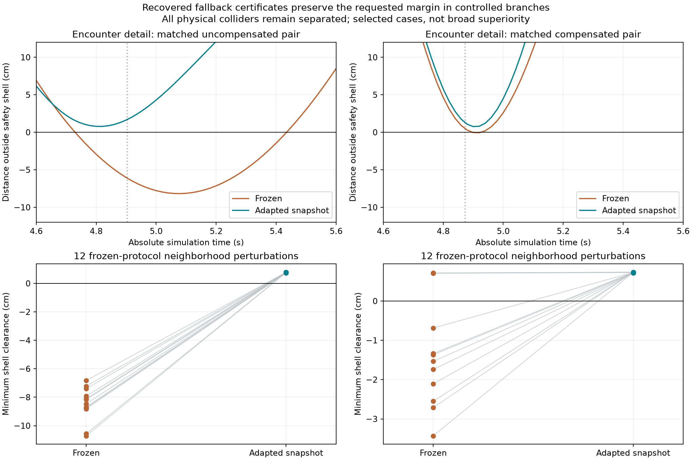
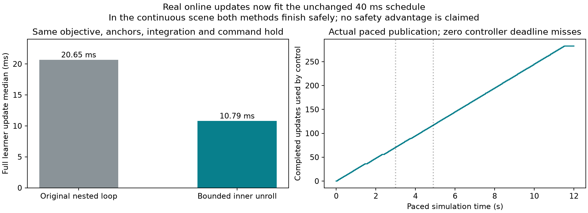

# Persistent-wind safety case and executable online learning

This revision finds a causal **clearance and certificate-availability advantage in controlled
encounter branches**, including a matched compensated comparison. It also makes the full online
learner fit the existing 40 ms schedule with actual completed updates. It does **not** establish
frozen physical collision versus adaptive survival: every tested physical collider remains
separated, and both methods succeed when the selected scene runs continuously from time zero.

The distinction is central to the result. A frozen finite-horizon repertoire can lose every
collision certificate while the unchanged controller still survives by combining shorter
fallback segments, emergency braking, and later QPs. Those behaviors remain enabled.

## What changed

- Added a persistent-wind encounter family with bounded, analytic absolute-time obstacle motion,
  explicit common-state branch clocks, and separate safety-shell, enclosing-body, oriented XML
  sphere, and floor audits. No motor cut manufactures a collision.
- Added obstacle-free prefix/behavior-atlas generation, cached swept-geometry discovery, complete
  per-eligible-policy QP screening, causal branches, critical-skill replacement, neighborhood
  confirmation, and continuous/paced episode commands.
- Added a reusable offline QP auditor. Its only counterfactual change is retaining an eligible
  policy as the selector incumbent. The full solver, actuator limits, operational faces,
  predictive refinements, nonlinear held checks, fallback, and emergency logic are shared.
- Reduced GPU loop overhead by bounded unrolling of the inner integration scan. The same two
  20 ms substeps remain inside each 40 ms command hold. The actor, reference targets, rotating
  anchor bank, optimizer, finite-update rule, physical limits, and control tolerances are unchanged.
- Preserved the previous hover/wind-removal/payload explanation. New videos are local only.

## Protocol and complete discovery budget

The starting repository is `c653e0b522654afd547a43bc93d7f74b545c6a08`. The artifact root is
`artifacts/da_plcbf/case-study-20260905`. Source hashes, checkpoints, full optimizer state,
references, configs, and publication scope accompany the evidence.

Both pairs use their declared competent version-660 restoration checkpoint. Each adaptive
prefix executes the shared compensated nominal hover controller at `[0,0,1.4]`, with calm air
until 3 s and persistent wind `[1.6,0.8,0]` m/s afterward. A completed update becomes available at
the next boundary. Snapshots at 4, 5, 7, and 9 s contain 25, 50, 100, and 150 wind updates,
respectively, plus 75 earlier calm updates. The full Adam history continues throughout.

Geometry is chosen **after** these obstacle-independent snapshots exist. Frozen/adapted paths,
the shared nominal, emergency brake, stationary hover, immutable nominal teacher, motors, and
per-skill tracking errors are retained. At 4 s the uncompensated frozen/adapted position tracking
RMSEs are approximately 0.09591/0.02043 m; the compensated pair is 0.03320/0.02111 m.

Every geometry family evaluates 512 seeded Sobol proposals at four anchors for each of two
mappings: **4,096 candidates per family; 12,288 total**. All outcomes remain in the ledger.

| Family | Geometry and result | Uncompensated accepted | Compensated accepted |
| --- | --- | ---: | ---: |
| v1 | Central offsets ±0.15 m, radii 0.25–0.85 m; generally blocks both libraries | 0 | 0 |
| v2 | Offsets ±0.6 m, bounded contrastively fitted radius 0.08–0.60 m | 351 | 53 |
| v3 | Radius up to 0.85 m, adaptive hard H target 0.035 m², actual emergency-sphere threat required | 341 | 168 |

All use a prescribed sinusoidal passage with 30 m amplitude; the incoming obstacle may start
outside the ego flight arena. No obstacle responds to either robot. Hard acceptance thresholds
remain `H_frozen < -0.002 m²` and `H_adapted > 0.025 m²`, with initially positive shell clearance.
The augmented maximum includes the nominal. Policy geometry and full-QP eligibility are separate.
The top six accepted cases per mapping in v2 and v3 receive full controller and closed-loop
checks. This is **selected development**, not an unbiased statistical comparison.

Small cached/GPU/full-controller graph differences are explicitly recorded, rather than hidden
behind an exact-replay claim. For example, the first v2 compensated maximum differs by about
0.000110 m². Geometry, initial state, model, and actuator identity were independently checked.
Stage C reevaluates the actual controller values against the unchanged acceptance thresholds.
Its full state gradients and time partials belong to that same controller evaluation.

## Controlled causal results

The two selected branches begin at exactly 4 s from their authenticated prefix state and
version-760 snapshot. Both methods share the state, model, goal, obstacle clock, and initial
selection convention. Frozen parameters remain version 660. These are controlled branches;
the obstacle-free prefix is **not** represented as an earlier filtered execution of this scene.

| Selected branch | Frozen minimum shell clearance | Adapted held snapshot | Frozen / adapted degraded controls |
| --- | ---: | ---: | ---: |
| Uncompensated U132 | −0.081758 m | +0.007777 m | 36 / 0 |
| Compensated C487 | −0.000903 m | +0.007324 m | 24 / 0 |

The shell is the 0.106 m body-origin enclosure plus the requested 0.15 m obstacle clearance.
The asset itself has radius 0.086 m and body offset `[0,0,0.02]` m. Its clearance uses the recorded
quaternion rotation, ≤1 ms interpolation, and an explicit obstacle/offset curvature bound.
These are geometric audits of the recorded point-plant trajectory, not measured MuJoCo contact.

At U132's first call, runtime augmented H is −0.234590/ +0.035299 m² for frozen/adapted. Frozen
has no eligible candidate; adapted has one, policy 5 (zero-based fallback 4), whose complete QP
and held checks pass. Its executed collision-policy dual is positive. The changed applied
wrench is recorded, and the learned constraint has positive executed dual at 18 controls.
At C487, H is −0.026717/ +0.035004 m²; the corresponding accepted learned policy is 10.
Across all 12 v3 screens, every adaptive eligible candidate passes its complete QP; no hidden
alternate-policy solver rescue is needed. Every frozen screen has zero eligible candidates.

U132's committed frozen library really is deficient: all 16 committed skills intersect the
oriented asset geometry, including about −4.46 mm for the initially selected skill. Nevertheless,
the normal frozen controller changes what it executes: fallback segments at 4.00–4.68 s,
emergency braking at 4.72–5.40 s, nominal fallback at 5.44 s, and QP from 5.48 s. It keeps about
94 mm actual asset clearance despite its shell violation. This identifies the baseline's saving
behavior instead of disabling it to create a crash.

The causal intervention results are retained in each `confirmation-*/causal_branches.json`:

- Holding the already available adapted snapshot is sufficient for the reported margin result.
- Continued learning applies 75 finite updates from each branch's own states; it also retains
  positive shell clearance with zero degraded controls in both selected cases.
- Replacing the consequential learned skill with its original evaluator preserves nominal and
  library size, including correct state differentiation. It produces three degraded controls in
  each case but still retains the margin: other adapted skills provide redundancy. The single
  replaced skill is therefore **not** claimed to be uniquely necessary for clearance retention.
- Halving plant integration to 10 ms while retaining the same 40 ms control hold and the same
  prediction duration/controller gives U132 −0.082873/+0.007079 m and C487
  −0.002641/+0.007154 m. This is a plant-integration check, not a changed prediction grid or a
  different held-control controller.

The `continued-provenance-v2` replay adds bound initial/final full Adam checkpoints, every
completed-update and published-snapshot hash, and recorded publication clocks. Both cases
exactly reproduce the original continued branch's compared state/action/value/version history
(maximum numerical difference zero). All 75 completed updates link to their next published
snapshots, with completion preceding publication.
Original runs did not record intermediate parameter hashes; the replay does not invent them
retroactively. Final version 835 follows the last executed version 834; the terminal diagnostic
is not counted as an applied command.

## Frozen neighborhood confirmation

Before drawing outcomes, each case fixes 12 perturbations with seeds 27581/27582: obstacle
offset ±15 mm, arrival ±40 ms, radius ±5 mm, starting position ±5 mm, velocity ±0.01 m/s, and
wind ±0.05 m/s per component. The wind perturbation is a common new model change at the branch;
the authenticated prefix and its already available snapshot are retained. These are controlled
neighborhood tests, not new continuously executed prefixes under perturbed wind.

| Pair | Frozen positive-shell outcomes | Adapted positive-shell outcomes | Additional detail |
| --- | ---: | ---: | --- |
| Uncompensated | 0/12 | 12/12 | Frozen −107.13 to −68.27 mm; adapted +7.44 to +7.89 mm, zero degraded |
| Compensated | 3/12 | 12/12 | Frozen −34.30 to +7.12 mm; adapted +7.12 to +7.35 mm; one run has one degraded command |

All physical asset geometries remain separated. These selected neighborhoods support local
margin and certificate benefits, including beyond the compensated comparator. They do not
establish physical-collision prevention, universal safety, or broad statistical superiority.



## Continuous scene: important negative confirmation

The exact U132 incoming obstacle is then present from time zero, wind starts at 3 s, the sphere
passes the hover neighborhood at 4.903185 s, navigation begins at 7 s, and wind stays active.
Both unchanged methods complete both waypoints with zero degraded controls.

| Execution | Frozen minimum shell clearance | Adaptive minimum shell clearance |
| --- | ---: | ---: |
| Deterministic | +0.009056 m | +0.007741 m |
| Paced | +0.009056 m | +0.007799 m |

The frozen controller can respond earlier than the controlled branch point. Consequently,
the controlled-branch advantage does **not** become an end-to-end safety advantage in this
continuous scene. Neither a timeout, shell breach, nor a motor-cut replay is counted as a
physical collision. No new collider impact video is manufactured.

## Implemented compute repair and actual paced updates

Profiling first tested rotating anchor microbatches of 2, 1, and 0. Their full-update medians
were 20.655, 20.549, and 19.667 ms: reducing the bank was not an effective repair. The default
two-anchor objective remains intact. Separate forward/gradient probes localized the dominant
cost to the sequential differentiated rollout rather than bank width.

Bounded inner-loop unrolling reduces the unchanged two-anchor update median from **20.655 to
10.791 ms**; p95 21.094→11.394 ms, maximum 22.120→11.492 ms across 50 synchronized updates.
Every finite update is retained. Unrolling is bounded at two even for longer supported holds.

Compiler graphs are not bitwise equivalent. The recorded wind rollout position difference is
at most 6.50 µm; velocity 1.51e−5 m/s; angular rate 4.77e−5 rad/s; parameter gradient max 2.15e−7;
next parameter max 5.96e−8. A strict blanket relative/absolute comparison failed near zero and
is preserved as a failed audit. Physical-unit effects, literal held integration, and gradient
checks are reported separately. The selected branches and continuous episodes above were
rerun on the revised implementation; old artifacts are not relabeled as byte-identical replay.

The paced scene uses the original scheduler: 40 ms period, 3 ms controller reserve, update
safety factor 1.25. It completes **283 finite updates**, with **117 already used** by the final
pre-arrival control at 4.88 s (version 777). Of those, 46 trained after wind onset and 71 during
calm hover. Every publication follows measured completion. Both methods have **zero controller
deadline misses**. Adaptive learner median/max are 10.652/11.493 ms; controller 9.426/16.688 ms.
This is measured online learning availability, distinct from the negative continuous safety
comparison. Hardware-specific service measurements are not a general real-time guarantee.



## Evidence, validation, and reproduction

The publication manifest distinguishes included numerical evidence from local-only videos and
bulk tensors. The all-candidate ledger, selected configs, controls, dense states, complete
initial/critical checkpoints and references, full-QP diagnostics, causal branches, negative
results, and static figures are retained. No generated video is added to Git.

The focused suite passed **55 tests** in 191.58 s, covering the core continuous filter,
persistent/reference learner, navigation runner, new geometry/discovery, complete QP audit,
runtime, and episode availability. Subsequent focused checks passed 9 provenance-guard tests,
4 bounded-hold tests, and 12 continuation-provenance tests. These checks overlap and are not
summed as unique tests; see the artifact test logs. Ruff and whitespace checks pass.

Use `.pixi/envs/gpu-tests/bin/python`, `PYTHONPATH=.`,
`XLA_PYTHON_CLIENT_PREALLOCATE=false`, and the recorded GPU software environment. Each command
requires a fresh output directory. The principal stages are:

```bash
python benchmark/da_plcbf_case_discovery.py atlas --output-dir NEW_ATLAS
python benchmark/da_plcbf_case_discovery.py geometry --atlas NEW_ATLAS --output-dir NEW_GEOMETRY_V1
python benchmark/da_plcbf_case_discovery.py refine --atlas NEW_ATLAS --seed 19302 --output-dir NEW_GEOMETRY_V2
python benchmark/da_plcbf_case_discovery.py refine-physical --atlas NEW_ATLAS --seed 19302 --output-dir NEW_GEOMETRY_V3
python benchmark/da_plcbf_case_discovery.py qp --atlas NEW_ATLAS --selected NEW_GEOMETRY_V3/selected.json --output-dir NEW_QP --limit 6
python benchmark/da_plcbf_case_attribution.py --atlas NEW_ATLAS --selected NEW_GEOMETRY_V3/selected.json --output-dir NEW_BRANCHES --limit 6 --record-video
python benchmark/da_plcbf_case_confirmation.py --atlas NEW_ATLAS --selected-directory SELECTED_BRANCH --output-dir NEW_CONFIRMATION --neighbors 12 --seed 27581
python benchmark/da_plcbf_case_episode.py --encounter SELECTED_BRANCH/encounter.json --output NEW_CONTINUOUS --execution-mode budgeted
```

The archived pre-unroll atlas fixes the selected experiment's historical parameters. New
atlas generation with the compiler repair is a fresh numerically close experiment, not an
assertion of identical optimizer history. Replaying the saved selected snapshots isolates
controller changes from newly generated training history.

The next stronger scientific target remains a **continuous** safety advantage against competent
baselines. The measured limiting link is now explicit: a lost committed-repertoire certificate
does not imply loss of the full controller's recoverability. Further encounter development
should account for its earlier response and hybrid fallback/emergency execution. There is no
evidence here justifying a weaker baseline, relaxed safety checks, or obstacle-dependent learning.
