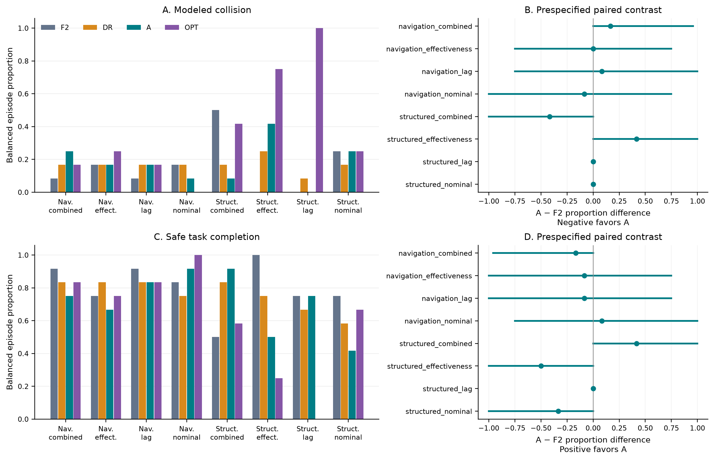
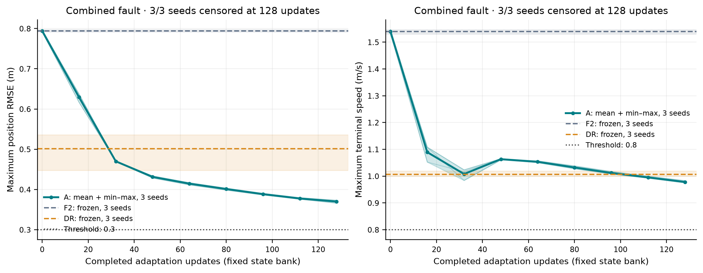
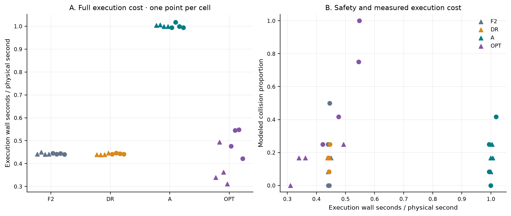
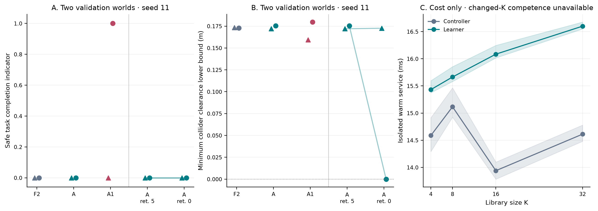
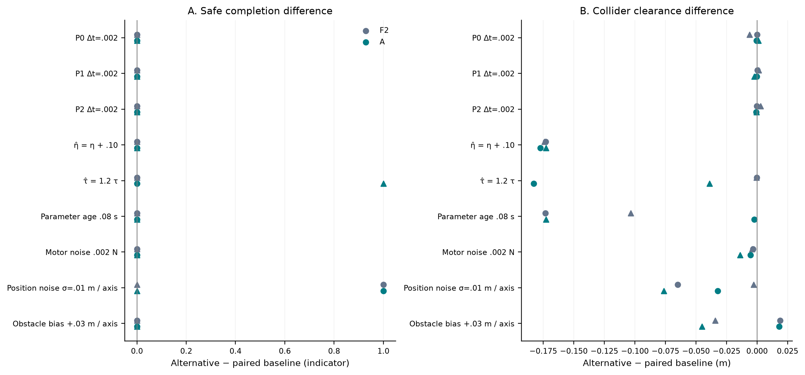

# Actuator study figures

Figures use completed retained data only. Relative links below point to PNG, PDF and exact plotted CSV data.

## 01_main_safety

[PDF](01_main_safety.pdf) · [Plot data](01_main_safety.csv)

Main sealed test matrix: four worlds per cell and three reused library seeds, giving 12 paired episodes per method and cell. Balanced episode proportions are shown with paired A minus F2 approximate crossed world/library percentile bootstrap intervals from the retained analysis, whose inputs are authenticated. Intervals use nominal 99.95833333% individual confidence after the sealed Bonferroni correction (95% family target); no world-any-event Wilson interval is placed on an episode-rate bar. Modeled collider intersection is not measured hardware contact. Counts and all plotted numbers are in the CSV. Bootstrap samples are not regenerated by this renderer; a separately supplied analysis digest can additionally authenticate the saved interval bytes.

## 02_fixed_bank_recovery

[PDF](02_fixed_bank_recovery.pdf) · [Plot data](02_fixed_bank_recovery.csv)

Obstacle-free combined-fault recovery on the same held-out bank of 16 physical states and 16 skills. Curves report the maximum over states and skills, with arithmetic mean and min–max across only three library seeds; the bands are not confidence intervals. Frozen F2 and DR use the same bank. Unmet thresholds are right-censored after 128 updates, never set to zero. A full tracking/braking pass also requires velocity RMSE ≤ 0.6 m/s. The x-axis is completed fixed-bank updates, not physical flight time; measured isolated update availability is retained in the CSV. See [censoring data](02_recovery_censoring.csv) for observed crossings without interpolation.

## 03_safety_and_execution_cost

[PDF](03_safety_and_execution_cost.pdf) · [Plot data](03_safety_and_execution_cost.csv)

Actual main-campaign execution wall time divided by executed physical exposure, first calculated per episode and then equally averaged within each cell/method. Wall time includes controller, adaptive learner when run, simulation/audit, diagnostics and loop overhead; it excludes compilation warmup and final artifact serialization. Early collision termination contributes only its executed prefix. Circles denote structured worlds and triangles navigation worlds. This deterministic execution diagnostic is not a real-time guarantee and does not substitute controller-only timing for A’s complete cost.

## 04_library_and_retention_ablations

[PDF](04_library_and_retention_ablations.pdf) · [Plot data](04_library_and_retention_ablations.csv)

A1 uses its separately prepared competent single-recovery checkpoint. Retention-off preserves the original K=16 actor and persistent optimizer while changing only the declared retention objective; points are paired by physical world. Each validation condition contains two worlds and one library seed, so results are descriptive, with no crossed confidence intervals. Circles are structured and triangles navigation worlds. K costs are synchronized isolated services, averaged equally over four fixed observations; shading spans the four observation means, not uncertainty. Changed K also changes initialization/optimizer or policy subset and possibly controller branches; competence is unavailable and no pure causal K effect or serialized real-time budget is claimed. [All measured cost samples](04_k_cost_samples.csv).

## 05_one_factor_mismatch

[PDF](05_one_factor_mismatch.pdf) · [Plot data](05_one_factor_mismatch.csv)

One-factor secondary validation differences on the same two physical worlds and library seed 11. P0 step .002 s is compared with the oracle P0 step .005 s; P1 and P2 at .002 s are compared with fine P0 to isolate plant model. Observation perturbations compare with the oracle baseline. Each point is one physical-world pair, with no crossed interval or population claim. Circles are structured and triangles navigation worlds. Positive values favor the alternative for both displayed metrics. Pacing and command delay are analyzed separately in figure 06 when explicitly supplied. Position noise is zero-mean Gaussian with .01 m standard deviation per coordinate. Obstacle bias adds (.03,.03,.03) m to observed/predicted centers, a .05196 m vector norm; physical obstacle paths stay unchanged. 

All consumed inputs and emitted figure/data files are SHA-256 bound in manifest.json. Missing inputs can omit a figure only with --missing skip; corrupt or contradictory supplied evidence is always fatal.
