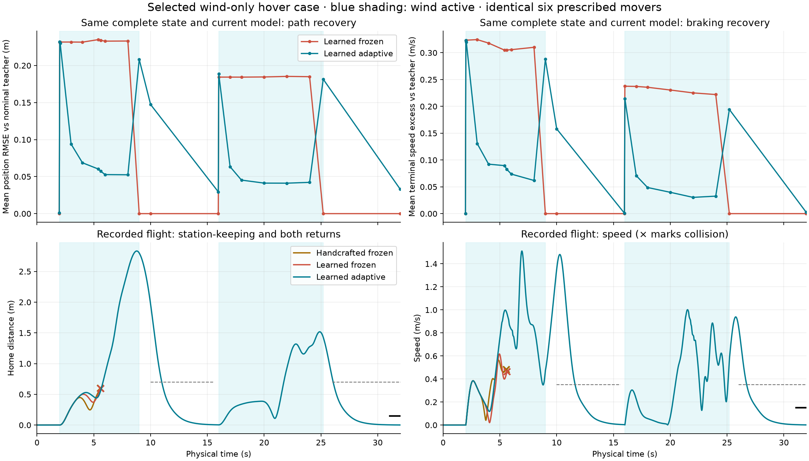

# Wind-only hover, avoidance, and return

The selected 32-second development case shows **adaptive-only survival with both returns home**. Handcrafted frozen and learned frozen collide during the first encounter, while learned adaptive avoids both waves, satisfies all recorded operational limits, and returns after each. A common-history ablation that stops learning at the first wind change collides too. This establishes a useful selected case for **PL-CBF with a committed-backup governor and online repertoire adaptation**. Nearby failures and the measured-latency result below limit its interpretation.

The [three-panel video](../artifacts/da_plcbf/hover-return-20260907/v1/video-v2/comparison.mp4) uses complete recorded flights and explicitly labeled motor-off contact suffixes. The [analysis](../artifacts/da_plcbf/hover-return-20260907/v1/analysis-v2/report.json), [all paired outcomes](../artifacts/da_plcbf/hover-return-20260907/v1/inventory-v1/outcomes.csv), and [review archive](../artifacts/da_plcbf/hover-return-20260907/v1/publication-v1/review-evidence.tar.gz) retain the evidence. Movies and full prediction arrays remain local; the archive and manifests bind them by SHA-256.

## Matched task and controllers

Home is `(0, 0, 1.7)` m. The nominal goal stays there for the entire episode; there is no waypoint-progress credit. Departing to avoid a threat is allowed, but collision-free drifting without return is unsuccessful. A return requires 0.8 continuous seconds within 0.7 m of home and below 0.35 m/s, inside the predefined windows 10–15.6 s and 26–32 s. The final second additionally requires position error and speed below 0.15 m and 0.15 m/s.

The initial wind-only calibration used a 0.4 m home tolerance and winds of 1.8, 2.6, and 3.4 m/s. At 1.8 m/s, ordinary uncompensated feedback bias exceeded that tolerance; at 2.6 and 3.4 m/s the runs also violated operational limits. All nine remained collision-free but failed the task, and those negative results are retained. Before introducing movers, a second calibration fixed the tolerance at 0.7 m and tested winds of 1.4, 1.8, and 2.2 m/s. All three methods completed all three tests. The final calm return remains a stricter, separate check. Neither tolerance was relaxed after observing the selected obstacle outcome.

Three-mover pilots and a bounded 16-case search preceded an eight-case denser search. The selected geometry has six continuously active spherical movers of radius 0.6 m. Their sinusoidal trajectories are prescribed by absolute time and identical for every method. Crossings are staggered from 6 to 8 s and repeat from 22 to 24 s; several paths have vertical offsets. Throughout both prescribed return windows, even the entire 0.7 m home tolerance ball is clear of the movers, drone enclosure and requested safety shell by at least 0.443 m; a 1 ms geometric check includes a mover-speed interpolation bound. The detailed positions, phases and amplitudes are in the [scene plan](../artifacts/da_plcbf/hover-return-20260907/v1/selected-replay-v2/scene-plan.json).

| Time | Actual, spatially uniform wind | Purpose |
|---|---|---|
| 0–2 s | Calm | Matched initialization |
| 2–9 s | `(1.789, 0.894, 0)` m/s; magnitude 2.0 m/s | First disturbance and encounter wave |
| 9–16 s | Calm | First return opportunity |
| 16–25.2 s | `(-1.131, 1.131, 0)` m/s; magnitude 1.6 m/s | 108.4° direction change and second wave |
| 25.2–32 s | Calm | Second and final return |

Actuators retain nominal effectiveness and 59 ms lag throughout; there is no fault or payload change. All arms use the same operational constraints, 40 ms command period, 1.2 s prediction horizon, current model information, feedback controller, and committed-backup governor. Direct wind feedforward is off in all three primary arms, including their teacher contracts. Wind stays in the plant, prediction and learning models. This is a known-current-wind experiment, not system identification. The learned frozen and adaptive controllers begin with identical complete learner and Adam states. The learner remains obstacle- and goal-agnostic; its objective and update rule were not tuned during this search.

## Selected complete outcome

| Controller | Modeled collider intersection | Recorded exposure | Successful returns | Final home distance | Time near home |
|---|---:|---:|---:|---:|---:|
| Handcrafted frozen | 5.57006 s | 5.575 s | 0/2; later windows unobserved | 0.598 m at collision | 3.780 s |
| Learned frozen | 5.61929 s | 5.620 s | 0/2; later windows unobserved | 0.591 m at collision | 4.195 s |
| Learned adaptive | None | 32.000 s | 2/2 | 0.00105 m | 18.155 s |

The adaptive arm completes the return dwells at 12.425 s and 27.530 s. It reaches a maximum home displacement of 2.833 m while avoiding the first wave. Final speed is 0.00115 m/s. All recorded operational checks pass. Its minimum clearance to the body-origin collision envelope is about 0.150 m, and to the offset XML collider about 0.158 m. The additional requested 0.15 m safety shell is approached closely; this is not a claim of a large robustness margin beyond that shell.

The final movie source is an exact rerun of direction-grid case 003: dense states, control inputs, commands, parameter hashes, selector results and backup trajectories match. An earlier diagnostic rerun added snapshot times; that changed floating-point integration boundaries and later states slightly despite the same qualitative outcome. It is retained as `selected-replay-v1`, but the promoted movie uses `selected-replay-v2` with the original capture schedule. Additional instrumentation is not treated as numerically inert.

## Causal and mechanism checks

The [first-onset freeze](../artifacts/da_plcbf/hover-return-20260907/v1/selected-freeze2-v1/report.json) stops updates at 2 s and collides at 5.615 s. Its first 51 controls through onset match the adaptive source, as do the physical state, all learner and Adam leaves, selector memory, and complete retained backup. The backup started at 0.04 s, retains its original anchor and parameters, and has a checked deadline of 3.16 s at the intervention. Freezing never clears or rebuilds that memory.

A second intervention freezes learning at 16 s, preserving 401 controls through the new wind change. It **still completes the task**. Re-adaptation improves behavior accuracy, but this selected flight does not establish that second-wave updates are necessary for survival. Both interventions and their negative implications are retained.

The [same-state behavior probes](../artifacts/da_plcbf/hover-return-20260907/v1/selected-mechanism-v1/report.json) evaluate the immutable nominal teacher, initial frozen repertoire, and current adaptive repertoire from the same complete 17-state, including motor effort. Both tested repertoires use the same current model and horizon. The values below average over fallback skills; they are separate from collision outcome measurements.

| Time | Frozen / adaptive position RMSE against teacher | Frozen / adaptive terminal-speed excess |
|---|---:|---:|
| 2.0 s: first wind onset | 0.232 / 0.232 m | 0.322 / 0.323 m/s |
| 4.0 s | 0.232 / 0.069 m | 0.318 / 0.092 m/s |
| 5.6 s: first critical encounter | 0.234 / 0.057 m | 0.305 / 0.083 m/s |
| 16.0 s: second wind onset | 0.184 / 0.189 m | 0.238 / 0.215 m/s |
| 20.0 s | 0.185 / 0.041 m | 0.231 / 0.040 m/s |



The [decision probes](../artifacts/da_plcbf/hover-return-20260907/v1/selected-decisions-v3/report.json) also hold obstacle time, goal and selector fixed. They reconstruct incoming governor memory and exactly reproduce all 11 sampled adaptive decisions, including commands and stored-parameter hashes. At 4 s, the adaptive controller selects a different policy with an active safety row and stores a learned continuation. At 5.4–5.6 s, neither current repertoire has a fresh eligible PL-CBF row; the actual controller executes a previously checked learned maneuver with its original parameters, anchor, phase and remaining deadline. That retained maneuver uses the parameters after 129 online updates, while the current repertoire has reached 140 updates at 5.6 s. Across the full flight, all 67 executed-backup controls use learned parameters, and all 800 control decisions have a checked continuation.

At 5.6 and 6 s, a separate empty-memory diagnostic can obtain a freshly checked backup from the adaptive repertoire but not the initial frozen repertoire. These are availability probes, not flight ablations. Keeping actual incoming adaptive memory lets a controller queried with frozen current parameters use the already learned retained backup as well. That is why replacing only current parameters at the last moment would be an invalid test of the whole learning history. At 20 s, adaptive has six eligible policies versus one frozen; at 22 s the frozen repertoire also admits a checked action. Learning does not dominate every local decision.

## Development selection and confirmation

All prespecified triplets, including incomplete tasks and collisions, are retained in the [outcome inventory](../artifacts/da_plcbf/hover-return-20260907/v1/inventory-v1/report.json). Development proceeded in bounded batches, with later batches informed by earlier results. The second-wind direction sweep has four successful adaptive-only cases out of eight; adaptive collides in the other four, and both frozen methods collide in all eight.

| Prespecified confirmation group | Cases | Handcrafted safe return | Frozen learned safe return | Adaptive safe return | Adaptive-only success |
|---|---:|---:|---:|---:|---:|
| Nearby one-factor variations | 8 | 0 | 4 | 5 | 4 |
| Fresh multi-factor configurations | 8 | 0 | 4 | 4 | 2 |

All other outcomes in these groups are collisions. The complete inventory contains 64 triplets across calibration, development and confirmation; those adaptively chosen stages are not pooled into a success-rate estimate.

The nearby set varies one factor at a time: wind magnitude ±2.5%, wind direction ±0.035 rad, mover radius ±2%, and encounter timing ±0.08 s. The fresh set uses eight new multi-factor configurations drawn before their outcomes, varying both wind directions, magnitude, mover offsets, radii, timing and speed. Physical world identities are distinct; these are not seed-only repetitions. “Fresh” refers to new configurations within this development family, not an independent deployment population. Positive cases support a reproducible mechanism; reversals of the ranking rule out a broad robustness claim.

The previous harmful actuator scenario remains in the [regression run](../artifacts/da_plcbf/hover-return-20260907/v1/harm-regression-v1/report.json). Learned frozen and adaptive both complete its full 14-second task with the governor. Earlier harmful-flight evidence and prior videos are unchanged. A separate stronger direct-wind-compensation comparison on the selected hover scene is also retained: learned frozen and adaptive collide at 6.340 s and 6.305 s respectively. Turning on feedforward changes the trajectory; it does not establish safety in this geometry.

## Measured timing and qualifications

The [measured-delay follow-up](../artifacts/da_plcbf/hover-return-20260907/v1/selected-delayed-v1/timing-audit.json) advances the plant under the old command throughout measured controller service, applies the new command only after it is available, and allows only learner work that fits the remaining budget. Full prediction-fan logging is disabled for timing, while normal decision records and safety audits remain active.

| Controller | Collision boundary | Controller service p95 / maximum | Missed 40 ms controller deadlines | Online updates actually used |
|---|---:|---:|---:|---:|
| Handcrafted frozen | 5.250 s | 55.7 / 948.0 ms | 49/62 | 0 |
| Learned frozen | 5.030 s | 48.6 / 570.0 ms | 37/73 | 0 |
| Learned adaptive | 4.760 s | 48.4 / 828.2 ms | 36/71 | 0 |

**The aligned survival result does not reproduce in this timing run.** No learner update fits the available budget; the adaptive arm uses its initial library throughout. Its maximum actual command hold is 598 ms, and all 71 intervals fail the sensing-alignment/duration coverage audit. Recorded dense commands and application times independently verify that delays act on the physical plant, rather than merely changing an update counter.

These measurements used an RTX 4090 (driver 555.42.06). All of this experiment's search and rendering jobs had finished, but another project started a compute job just before the test; sampled peer GPU utilization was 62%. The environment record explicitly marks this as **concurrent-load timing**, not an exclusive-device benchmark. No unrelated process was interrupted. Three initial-state warmup calls also do not establish that every later governor branch is compiled. This result identifies an implementation/scheduling limitation under the measured conditions, not a clean hardware capacity limit or a deployable online-adaptation result.

Aligned execution forces finite learner completions to publish at the following simulated control boundary. Its 799 online updates used by the last adaptive command do not establish real-time feasibility. The governor rechecks retained trajectories under the current model and has a finite horizon; it does not guarantee recovery from an unannounced future wind change. A checked plan at sensing time also does not certify an action applied later from a changed state. Timing follow-ups must retain these qualifications rather than inherit the aligned run's success label as a deployment claim.

## Video verification and reproduction

The movie has 641 frames at 20 fps, 2400×900 pixels, including the 32 s endpoint; encoded duration is 32.05 s. Colored paths are saved current predictions, white is the flown trail, cyan depicts the actual wind, and gold identifies execution of a checked backup. All panels use a 0–0.25 N motor scale. Home distance, speed, completed return windows and online updates are displayed.

For both collided frozen arms, only the suffix after geometric contact switches to a separate MuJoCo motor-off simulation, initialized from the recorded pose and velocities. Commands and thrust become zero, predictions stop, and the screen labels that assumption. Obstacles and wind keep the same absolute clock. The original controlled episodes end at collision; the crash animation contributes no exposure or task credit. The [video audit](../artifacts/da_plcbf/hover-return-20260907/v1/video-v2/validation.json) checks each recorded prefix frame, each contact suffix pose and quaternion against its separate simulation, source hashes, preview pixels, frame count and full decoding.

Use the repository's GPU environment with `PYTHONPATH=.`, `SCIPY_ARRAY_API=1`, `XLA_PYTHON_CLIENT_PREALLOCATE=false`, and a JAX compilation cache. Source plans preserve every historical configuration; do not substitute the current scene-spec defaults for an earlier plan. For a fresh checkout, first unpack this review archive and the earlier wind-learning-comparison review archive at the repository root; the latter restores the derived deployment checkpoints used by `resources()`. Use `selected-replay-v2` as the follow-up source when only archived evidence is available, since its complete initial checkpoints are included.

```bash
python -m benchmark.da_plcbf_hover_followup \
  artifacts/da_plcbf/hover-return-20260907/v1/direction-refinement-v1/case-003 \
  --output /new/output/selected --mode replay
python -m benchmark.da_plcbf_hover_followup \
  /new/output/selected --output /new/output/freeze --mode freeze --freeze-at 2
```

For rendering, use CPU JAX and `MUJOCO_GL=osmesa`, run `benchmark.da_plcbf_hover_video` separately with stage `PD_F`, `F2`, and `A_BAL`, passing `--source /new/output/selected --output /new/output/video`, then its `combine` stage. The checked-in analysis, confirmation, decision, figure, inventory and video-audit drivers identify the exact promoted artifacts. Episode and stage directories are exclusive to prevent silent replacement.

Targeted validation: **43 tests pass** across hover scoring, retained-backup behavior/memory, wind handling and episode execution. Ruff passes on the changed source and experiment drivers. This is targeted validation, not a new repository-wide or hardware-flight certification.
